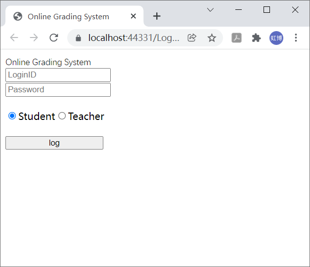
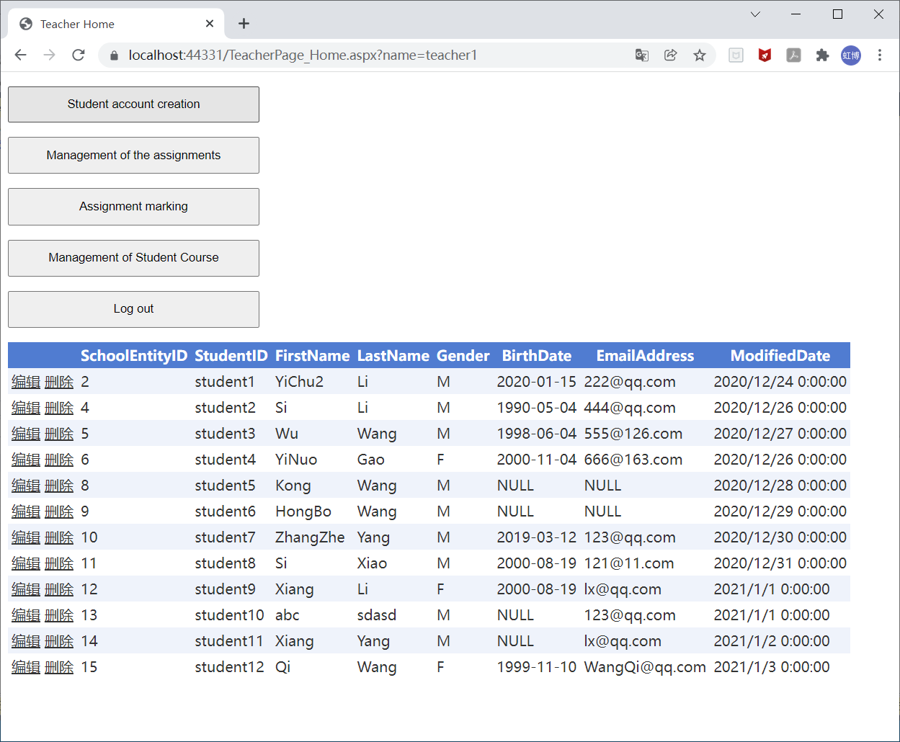

# Online Grading System

-----

>  Author: [@Hongbo Wang ](https://github.com/BOBWang1117) 

>  

## **Environment:**

- Microsoft Visual Studio

- Microsoft SQL Server Management Studio

  

## **Details**

- Type: term project
- Teacher: 罗少龙
- Computer Language: MySQL, ASP.NET
- Project Name: Online Grading System
- Time: 2020/1/3
- Description: Online Grading System Design is a web application developed by ASP.NET Web application (.NET Framework) in C# Language. In this project, I used two software to build it Visual Studio 2019 and SQL Server Management Studio 18. Besides, the test software is Google Chrome.
  This online grading system is a web-based application will be developed using ASP.NET and SQL Server. The main purpose of this system is to facilitate calculation of the average marks or grades of a student through online.

## **Dependencies:** 

- Chrome

## **Install package:**

- None

## **Run program:**

- add ASP.NET code into Visual Studio
- add SQL code into SQL Server Management Studio

## **Example:**

1.

2.

